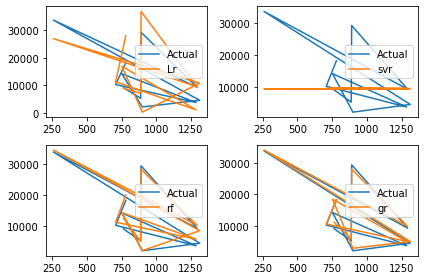

#Health Insurance Cost Prediction Using Machine Learning
Questions : 

1. Display Top 5 Rows of The Dataset
2. Check Last 5 Rows of The Dataset
3. Find Shape of Our Dataset (Number of Rows And Number of Columns)
4. Get Information About Our Dataset Like Total Number Rows, Total Number of Columns, Datatypes of Each Column And Memory Requirement
5. Check Null Values In The Dataset
6. Get Overall Statistics About The Dataset
Covert Columns From String ['sex','smoker', 'region' ] To Numerical Values
8. Store Feature Matrix In X and Response(Target) In Vector y
9. Train/Test split
          1. Split data into two-part: a training set and a testing set
          2. Train the model(s) on the training set
          3. Test the Model(s) on the Testing set
10. Import the models
11. Model Training
12. Prediction on Test Data
13. Compare Performance Visually 
14. Evaluating the Algorithm
15. Final Report with Create_Report library


```python
import pandas as pd
```


```python
df = pd.read_csv('C:/Users/Vishal Singh/Desktop/insurance projects/insurance.csv')
```

# 1. Display Top 5 Rows of the Dataset


```python
df.head()
```


<div>
<style scoped>
    .dataframe tbody tr th:only-of-type {
        vertical-align: middle;
    }

    .dataframe tbody tr th {
        vertical-align: top;
    }

    .dataframe thead th {
        text-align: right;
    }
</style>
<table border="1" class="dataframe">
  <thead>
    <tr style="text-align: right;">
      <th></th>
      <th>age</th>
      <th>sex</th>
      <th>bmi</th>
      <th>children</th>
      <th>smoker</th>
      <th>region</th>
    </tr>
  </thead>
  <tbody>
    <tr>
      <th>0</th>
      <td>60</td>
      <td>1</td>
      <td>56.6</td>
      <td>6</td>
      <td>1</td>
      <td>2</td>
    </tr>
  </tbody>
</table>
</div>


```python
df.head(20)
```


<div>
<style scoped>
    .dataframe tbody tr th:only-of-type {
        vertical-align: middle;
    }

    .dataframe tbody tr th {
        vertical-align: top;
    }

    .dataframe thead th {
        text-align: right;
    }
</style>
<table border="1" class="dataframe">
  <thead>
    <tr style="text-align: right;">
      <th></th>
      <th>age</th>
      <th>sex</th>
      <th>bmi</th>
      <th>children</th>
      <th>smoker</th>
      <th>region</th>
      <th>charges</th>
    </tr>
  </thead>
  <tbody>
    <tr>
      <th>0</th>
      <td>19</td>
      <td>female</td>
      <td>27.9</td>
      <td>0</td>
      <td>yes</td>
      <td>southwest</td>
      <td>16884.92</td>
    </tr>
    <tr>
      <th>1</th>
      <td>18</td>
      <td>male</td>
      <td>33.8</td>
      <td>1</td>
      <td>no</td>
      <td>southeast</td>
      <td>1725.55</td>
    </tr>
    <tr>
      <th>2</th>
      <td>28</td>
      <td>male</td>
      <td>33.0</td>
      <td>3</td>
      <td>no</td>
      <td>southeast</td>
      <td>4449.46</td>
    </tr>
    <tr>
      <th>3</th>
      <td>33</td>
      <td>male</td>
      <td>22.7</td>
      <td>0</td>
      <td>no</td>
      <td>northwest</td>
      <td>21984.47</td>
    </tr>
    <tr>
      <th>4</th>
      <td>32</td>
      <td>male</td>
      <td>28.9</td>
      <td>0</td>
      <td>no</td>
      <td>northwest</td>
      <td>3866.86</td>
    </tr>
    <tr>
      <th>5</th>
      <td>31</td>
      <td>female</td>
      <td>25.7</td>
      <td>0</td>
      <td>no</td>
      <td>southeast</td>
      <td>3756.62</td>
    </tr>
    <tr>
      <th>6</th>
      <td>46</td>
      <td>female</td>
      <td>33.4</td>
      <td>1</td>
      <td>no</td>
      <td>southeast</td>
      <td>8240.59</td>
    </tr>
    <tr>
      <th>7</th>
      <td>37</td>
      <td>female</td>
      <td>27.7</td>
      <td>3</td>
      <td>no</td>
      <td>northwest</td>
      <td>7281.51</td>
    </tr>
    <tr>
      <th>8</th>
      <td>37</td>
      <td>male</td>
      <td>29.8</td>
      <td>2</td>
      <td>no</td>
      <td>northeast</td>
      <td>6406.41</td>
    </tr>
    <tr>
      <th>9</th>
      <td>60</td>
      <td>female</td>
      <td>25.8</td>
      <td>0</td>
      <td>no</td>
      <td>northwest</td>
      <td>28923.14</td>
    </tr>
    <tr>
      <th>10</th>
      <td>25</td>
      <td>male</td>
      <td>26.2</td>
      <td>0</td>
      <td>no</td>
      <td>northeast</td>
      <td>2721.32</td>
    </tr>
    <tr>
      <th>11</th>
      <td>62</td>
      <td>female</td>
      <td>26.3</td>
      <td>0</td>
      <td>yes</td>
      <td>southeast</td>
      <td>27808.73</td>
    </tr>
    <tr>
      <th>12</th>
      <td>23</td>
      <td>male</td>
      <td>34.4</td>
      <td>0</td>
      <td>no</td>
      <td>southwest</td>
      <td>1826.84</td>
    </tr>
    <tr>
      <th>13</th>
      <td>56</td>
      <td>female</td>
      <td>39.8</td>
      <td>0</td>
      <td>no</td>
      <td>southeast</td>
      <td>11090.72</td>
    </tr>
    <tr>
      <th>14</th>
      <td>27</td>
      <td>male</td>
      <td>42.1</td>
      <td>0</td>
      <td>yes</td>
      <td>southeast</td>
      <td>39611.76</td>
    </tr>
    <tr>
      <th>15</th>
      <td>19</td>
      <td>male</td>
      <td>24.6</td>
      <td>1</td>
      <td>no</td>
      <td>southwest</td>
      <td>1837.24</td>
    </tr>
    <tr>
      <th>16</th>
      <td>52</td>
      <td>female</td>
      <td>30.8</td>
      <td>1</td>
      <td>no</td>
      <td>northeast</td>
      <td>10797.34</td>
    </tr>
    <tr>
      <th>17</th>
      <td>23</td>
      <td>male</td>
      <td>23.8</td>
      <td>0</td>
      <td>no</td>
      <td>northeast</td>
      <td>2395.17</td>
    </tr>
    <tr>
      <th>18</th>
      <td>56</td>
      <td>male</td>
      <td>40.3</td>
      <td>0</td>
      <td>no</td>
      <td>southwest</td>
      <td>10602.39</td>
    </tr>
    <tr>
      <th>19</th>
      <td>30</td>
      <td>male</td>
      <td>35.3</td>
      <td>0</td>
      <td>yes</td>
      <td>southwest</td>
      <td>36837.47</td>
    </tr>
  </tbody>
</table>
</div>


# 2. Check Last 5 Rows of the Dataset


```python
df.tail()
```


<div>
<style scoped>
    .dataframe tbody tr th:only-of-type {
        vertical-align: middle;
    }

    .dataframe tbody tr th {
        vertical-align: top;
    }

    .dataframe thead th {
        text-align: right;
    }
</style>
<table border="1" class="dataframe">
  <thead>
    <tr style="text-align: right;">
      <th></th>
      <th>age</th>
      <th>sex</th>
      <th>bmi</th>
      <th>children</th>
      <th>smoker</th>
      <th>region</th>
      <th>charges</th>
    </tr>
  </thead>
  <tbody>
    <tr>
      <th>1333</th>
      <td>50</td>
      <td>male</td>
      <td>31.0</td>
      <td>3</td>
      <td>no</td>
      <td>northwest</td>
      <td>10600.55</td>
    </tr>
    <tr>
      <th>1334</th>
      <td>18</td>
      <td>female</td>
      <td>31.9</td>
      <td>0</td>
      <td>no</td>
      <td>northeast</td>
      <td>2205.98</td>
    </tr>
    <tr>
      <th>1335</th>
      <td>18</td>
      <td>female</td>
      <td>36.9</td>
      <td>0</td>
      <td>no</td>
      <td>southeast</td>
      <td>1629.83</td>
    </tr>
    <tr>
      <th>1336</th>
      <td>21</td>
      <td>female</td>
      <td>25.8</td>
      <td>0</td>
      <td>no</td>
      <td>southwest</td>
      <td>2007.95</td>
    </tr>
    <tr>
      <th>1337</th>
      <td>61</td>
      <td>female</td>
      <td>29.1</td>
      <td>0</td>
      <td>yes</td>
      <td>northwest</td>
      <td>29141.36</td>
    </tr>
  </tbody>
</table>
</div>


# 3. Find Shape of Our Dataset(Number of Rows And Number of Columns)


```python
df.shape
```


    (1338, 7)


```python
print('Number of Rows',df.shape[0])
print("Number of Columns",df.shape[1])
```

    Number of Rows 1338
    Number of Columns 7
    

# 4. Get information About Our Dataset Like Total Number Rows, Total Number of Columns, Datatypes of Each Column And Memory Requirement


```python
df.info()
```

    <class 'pandas.core.frame.DataFrame'>
    RangeIndex: 1338 entries, 0 to 1337
    Data columns (total 7 columns):
     #   Column    Non-Null Count  Dtype  
    ---  ------    --------------  -----  
     0   age       1338 non-null   int64  
     1   sex       1338 non-null   object 
     2   bmi       1338 non-null   float64
     3   children  1338 non-null   int64  
     4   smoker    1338 non-null   object 
     5   region    1338 non-null   object 
     6   charges   1338 non-null   float64
    dtypes: float64(2), int64(2), object(3)
    memory usage: 73.3+ KB
    

# 5. Check Null Values In The Dataset


```python
df.isnull()
```


<div>
<style scoped>
    .dataframe tbody tr th:only-of-type {
        vertical-align: middle;
    }

    .dataframe tbody tr th {
        vertical-align: top;
    }

    .dataframe thead th {
        text-align: right;
    }
</style>
<table border="1" class="dataframe">
  <thead>
    <tr style="text-align: right;">
      <th></th>
      <th>age</th>
      <th>sex</th>
      <th>bmi</th>
      <th>children</th>
      <th>smoker</th>
      <th>region</th>
      <th>charges</th>
    </tr>
  </thead>
  <tbody>
    <tr>
      <th>0</th>
      <td>False</td>
      <td>False</td>
      <td>False</td>
      <td>False</td>
      <td>False</td>
      <td>False</td>
      <td>False</td>
    </tr>
    <tr>
      <th>1</th>
      <td>False</td>
      <td>False</td>
      <td>False</td>
      <td>False</td>
      <td>False</td>
      <td>False</td>
      <td>False</td>
    </tr>
    <tr>
      <th>2</th>
      <td>False</td>
      <td>False</td>
      <td>False</td>
      <td>False</td>
      <td>False</td>
      <td>False</td>
      <td>False</td>
    </tr>
    <tr>
      <th>3</th>
      <td>False</td>
      <td>False</td>
      <td>False</td>
      <td>False</td>
      <td>False</td>
      <td>False</td>
      <td>False</td>
    </tr>
    <tr>
      <th>4</th>
      <td>False</td>
      <td>False</td>
      <td>False</td>
      <td>False</td>
      <td>False</td>
      <td>False</td>
      <td>False</td>
    </tr>
    <tr>
      <th>...</th>
      <td>...</td>
      <td>...</td>
      <td>...</td>
      <td>...</td>
      <td>...</td>
      <td>...</td>
      <td>...</td>
    </tr>
    <tr>
      <th>1333</th>
      <td>False</td>
      <td>False</td>
      <td>False</td>
      <td>False</td>
      <td>False</td>
      <td>False</td>
      <td>False</td>
    </tr>
    <tr>
      <th>1334</th>
      <td>False</td>
      <td>False</td>
      <td>False</td>
      <td>False</td>
      <td>False</td>
      <td>False</td>
      <td>False</td>
    </tr>
    <tr>
      <th>1335</th>
      <td>False</td>
      <td>False</td>
      <td>False</td>
      <td>False</td>
      <td>False</td>
      <td>False</td>
      <td>False</td>
    </tr>
    <tr>
      <th>1336</th>
      <td>False</td>
      <td>False</td>
      <td>False</td>
      <td>False</td>
      <td>False</td>
      <td>False</td>
      <td>False</td>
    </tr>
    <tr>
      <th>1337</th>
      <td>False</td>
      <td>False</td>
      <td>False</td>
      <td>False</td>
      <td>False</td>
      <td>False</td>
      <td>False</td>
    </tr>
  </tbody>
</table>
<p>1338 rows × 7 columns</p>
</div>


```python
df.isnull().sum()
```


    age         0
    sex         0
    bmi         0
    children    0
    smoker      0
    region      0
    charges     0
    dtype: int64


# Get Overall Statistics About The Dataset


```python
df.describe()
```


<div>
<style scoped>
    .dataframe tbody tr th:only-of-type {
        vertical-align: middle;
    }

    .dataframe tbody tr th {
        vertical-align: top;
    }

    .dataframe thead th {
        text-align: right;
    }
</style>
<table border="1" class="dataframe">
  <thead>
    <tr style="text-align: right;">
      <th></th>
      <th>age</th>
      <th>bmi</th>
      <th>children</th>
      <th>charges</th>
    </tr>
  </thead>
  <tbody>
    <tr>
      <th>count</th>
      <td>1338.000000</td>
      <td>1338.000000</td>
      <td>1338.000000</td>
      <td>1338.000000</td>
    </tr>
    <tr>
      <th>mean</th>
      <td>39.207025</td>
      <td>30.665471</td>
      <td>1.094918</td>
      <td>13270.422414</td>
    </tr>
    <tr>
      <th>std</th>
      <td>14.049960</td>
      <td>6.098382</td>
      <td>1.205493</td>
      <td>12110.011240</td>
    </tr>
    <tr>
      <th>min</th>
      <td>18.000000</td>
      <td>16.000000</td>
      <td>0.000000</td>
      <td>1121.870000</td>
    </tr>
    <tr>
      <th>25%</th>
      <td>27.000000</td>
      <td>26.300000</td>
      <td>0.000000</td>
      <td>4740.287500</td>
    </tr>
    <tr>
      <th>50%</th>
      <td>39.000000</td>
      <td>30.400000</td>
      <td>1.000000</td>
      <td>9382.030000</td>
    </tr>
    <tr>
      <th>75%</th>
      <td>51.000000</td>
      <td>34.700000</td>
      <td>2.000000</td>
      <td>16639.915000</td>
    </tr>
    <tr>
      <th>max</th>
      <td>64.000000</td>
      <td>53.100000</td>
      <td>5.000000</td>
      <td>63770.430000</td>
    </tr>
  </tbody>
</table>
</div>


```python
df.describe(include = 'all')
```


<div>
<style scoped>
    .dataframe tbody tr th:only-of-type {
        vertical-align: middle;
    }

    .dataframe tbody tr th {
        vertical-align: top;
    }

    .dataframe thead th {
        text-align: right;
    }
</style>
<table border="1" class="dataframe">
  <thead>
    <tr style="text-align: right;">
      <th></th>
      <th>age</th>
      <th>sex</th>
      <th>bmi</th>
      <th>children</th>
      <th>smoker</th>
      <th>region</th>
      <th>charges</th>
    </tr>
  </thead>
  <tbody>
    <tr>
      <th>count</th>
      <td>1338.000000</td>
      <td>1338</td>
      <td>1338.000000</td>
      <td>1338.000000</td>
      <td>1338</td>
      <td>1338</td>
      <td>1338.000000</td>
    </tr>
    <tr>
      <th>unique</th>
      <td>NaN</td>
      <td>2</td>
      <td>NaN</td>
      <td>NaN</td>
      <td>2</td>
      <td>4</td>
      <td>NaN</td>
    </tr>
    <tr>
      <th>top</th>
      <td>NaN</td>
      <td>male</td>
      <td>NaN</td>
      <td>NaN</td>
      <td>no</td>
      <td>southeast</td>
      <td>NaN</td>
    </tr>
    <tr>
      <th>freq</th>
      <td>NaN</td>
      <td>676</td>
      <td>NaN</td>
      <td>NaN</td>
      <td>1064</td>
      <td>364</td>
      <td>NaN</td>
    </tr>
    <tr>
      <th>mean</th>
      <td>39.207025</td>
      <td>NaN</td>
      <td>30.665471</td>
      <td>1.094918</td>
      <td>NaN</td>
      <td>NaN</td>
      <td>13270.422414</td>
    </tr>
    <tr>
      <th>std</th>
      <td>14.049960</td>
      <td>NaN</td>
      <td>6.098382</td>
      <td>1.205493</td>
      <td>NaN</td>
      <td>NaN</td>
      <td>12110.011240</td>
    </tr>
    <tr>
      <th>min</th>
      <td>18.000000</td>
      <td>NaN</td>
      <td>16.000000</td>
      <td>0.000000</td>
      <td>NaN</td>
      <td>NaN</td>
      <td>1121.870000</td>
    </tr>
    <tr>
      <th>25%</th>
      <td>27.000000</td>
      <td>NaN</td>
      <td>26.300000</td>
      <td>0.000000</td>
      <td>NaN</td>
      <td>NaN</td>
      <td>4740.287500</td>
    </tr>
    <tr>
      <th>50%</th>
      <td>39.000000</td>
      <td>NaN</td>
      <td>30.400000</td>
      <td>1.000000</td>
      <td>NaN</td>
      <td>NaN</td>
      <td>9382.030000</td>
    </tr>
    <tr>
      <th>75%</th>
      <td>51.000000</td>
      <td>NaN</td>
      <td>34.700000</td>
      <td>2.000000</td>
      <td>NaN</td>
      <td>NaN</td>
      <td>16639.915000</td>
    </tr>
    <tr>
      <th>max</th>
      <td>64.000000</td>
      <td>NaN</td>
      <td>53.100000</td>
      <td>5.000000</td>
      <td>NaN</td>
      <td>NaN</td>
      <td>63770.430000</td>
    </tr>
  </tbody>
</table>
</div>


# 7. Convert Columns From String ['sex','smoker','region'] To Numerical Values


```python
df.head()
```


<div>
<style scoped>
    .dataframe tbody tr th:only-of-type {
        vertical-align: middle;
    }

    .dataframe tbody tr th {
        vertical-align: top;
    }

    .dataframe thead th {
        text-align: right;
    }
</style>
<table border="1" class="dataframe">
  <thead>
    <tr style="text-align: right;">
      <th></th>
      <th>age</th>
      <th>sex</th>
      <th>bmi</th>
      <th>children</th>
      <th>smoker</th>
      <th>region</th>
      <th>charges</th>
    </tr>
  </thead>
  <tbody>
    <tr>
      <th>0</th>
      <td>19</td>
      <td>female</td>
      <td>27.9</td>
      <td>0</td>
      <td>yes</td>
      <td>southwest</td>
      <td>16884.92</td>
    </tr>
    <tr>
      <th>1</th>
      <td>18</td>
      <td>male</td>
      <td>33.8</td>
      <td>1</td>
      <td>no</td>
      <td>southeast</td>
      <td>1725.55</td>
    </tr>
    <tr>
      <th>2</th>
      <td>28</td>
      <td>male</td>
      <td>33.0</td>
      <td>3</td>
      <td>no</td>
      <td>southeast</td>
      <td>4449.46</td>
    </tr>
    <tr>
      <th>3</th>
      <td>33</td>
      <td>male</td>
      <td>22.7</td>
      <td>0</td>
      <td>no</td>
      <td>northwest</td>
      <td>21984.47</td>
    </tr>
    <tr>
      <th>4</th>
      <td>32</td>
      <td>male</td>
      <td>28.9</td>
      <td>0</td>
      <td>no</td>
      <td>northwest</td>
      <td>3866.86</td>
    </tr>
  </tbody>
</table>
</div>


```python
df['sex'].unique()
```


    array(['female', 'male'], dtype=object)


```python
df['sex'].map({'female':0,'male':1})
```


    0       0
    1       1
    2       1
    3       1
    4       1
           ..
    1333    1
    1334    0
    1335    0
    1336    0
    1337    0
    Name: sex, Length: 1338, dtype: int64


```python
df['sex']=df['sex'].map({'female':0,'male':1})
```


```python
df
```


<div>
<style scoped>
    .dataframe tbody tr th:only-of-type {
        vertical-align: middle;
    }

    .dataframe tbody tr th {
        vertical-align: top;
    }

    .dataframe thead th {
        text-align: right;
    }
</style>
<table border="1" class="dataframe">
  <thead>
    <tr style="text-align: right;">
      <th></th>
      <th>age</th>
      <th>sex</th>
      <th>bmi</th>
      <th>children</th>
      <th>smoker</th>
      <th>region</th>
      <th>charges</th>
    </tr>
  </thead>
  <tbody>
    <tr>
      <th>0</th>
      <td>19</td>
      <td>0</td>
      <td>27.9</td>
      <td>0</td>
      <td>yes</td>
      <td>southwest</td>
      <td>16884.92</td>
    </tr>
    <tr>
      <th>1</th>
      <td>18</td>
      <td>1</td>
      <td>33.8</td>
      <td>1</td>
      <td>no</td>
      <td>southeast</td>
      <td>1725.55</td>
    </tr>
    <tr>
      <th>2</th>
      <td>28</td>
      <td>1</td>
      <td>33.0</td>
      <td>3</td>
      <td>no</td>
      <td>southeast</td>
      <td>4449.46</td>
    </tr>
    <tr>
      <th>3</th>
      <td>33</td>
      <td>1</td>
      <td>22.7</td>
      <td>0</td>
      <td>no</td>
      <td>northwest</td>
      <td>21984.47</td>
    </tr>
    <tr>
      <th>4</th>
      <td>32</td>
      <td>1</td>
      <td>28.9</td>
      <td>0</td>
      <td>no</td>
      <td>northwest</td>
      <td>3866.86</td>
    </tr>
    <tr>
      <th>...</th>
      <td>...</td>
      <td>...</td>
      <td>...</td>
      <td>...</td>
      <td>...</td>
      <td>...</td>
      <td>...</td>
    </tr>
    <tr>
      <th>1333</th>
      <td>50</td>
      <td>1</td>
      <td>31.0</td>
      <td>3</td>
      <td>no</td>
      <td>northwest</td>
      <td>10600.55</td>
    </tr>
    <tr>
      <th>1334</th>
      <td>18</td>
      <td>0</td>
      <td>31.9</td>
      <td>0</td>
      <td>no</td>
      <td>northeast</td>
      <td>2205.98</td>
    </tr>
    <tr>
      <th>1335</th>
      <td>18</td>
      <td>0</td>
      <td>36.9</td>
      <td>0</td>
      <td>no</td>
      <td>southeast</td>
      <td>1629.83</td>
    </tr>
    <tr>
      <th>1336</th>
      <td>21</td>
      <td>0</td>
      <td>25.8</td>
      <td>0</td>
      <td>no</td>
      <td>southwest</td>
      <td>2007.95</td>
    </tr>
    <tr>
      <th>1337</th>
      <td>61</td>
      <td>0</td>
      <td>29.1</td>
      <td>0</td>
      <td>yes</td>
      <td>northwest</td>
      <td>29141.36</td>
    </tr>
  </tbody>
</table>
<p>1338 rows × 7 columns</p>
</div>


```python
df['smoker']=df['smoker'].map({'yes':1,'no':0})
```


```python
df['region']=df['region'].map({'southwest':1,'southeast':2,
                   'northwest':3,'northeast':4})
```


```python
df.head()
```


<div>
<style scoped>
    .dataframe tbody tr th:only-of-type {
        vertical-align: middle;
    }

    .dataframe tbody tr th {
        vertical-align: top;
    }

    .dataframe thead th {
        text-align: right;
    }
</style>
<table border="1" class="dataframe">
  <thead>
    <tr style="text-align: right;">
      <th></th>
      <th>age</th>
      <th>sex</th>
      <th>bmi</th>
      <th>children</th>
      <th>smoker</th>
      <th>region</th>
      <th>charges</th>
    </tr>
  </thead>
  <tbody>
    <tr>
      <th>0</th>
      <td>19</td>
      <td>0</td>
      <td>27.9</td>
      <td>0</td>
      <td>1</td>
      <td>1</td>
      <td>16884.92</td>
    </tr>
    <tr>
      <th>1</th>
      <td>18</td>
      <td>1</td>
      <td>33.8</td>
      <td>1</td>
      <td>0</td>
      <td>2</td>
      <td>1725.55</td>
    </tr>
    <tr>
      <th>2</th>
      <td>28</td>
      <td>1</td>
      <td>33.0</td>
      <td>3</td>
      <td>0</td>
      <td>2</td>
      <td>4449.46</td>
    </tr>
    <tr>
      <th>3</th>
      <td>33</td>
      <td>1</td>
      <td>22.7</td>
      <td>0</td>
      <td>0</td>
      <td>3</td>
      <td>21984.47</td>
    </tr>
    <tr>
      <th>4</th>
      <td>32</td>
      <td>1</td>
      <td>28.9</td>
      <td>0</td>
      <td>0</td>
      <td>3</td>
      <td>3866.86</td>
    </tr>
  </tbody>
</table>
</div>


# 8. Store Feature Matrix In X and Response(Target) In Vector y


```python
X = df.drop(['charges'],axis=1)
y = df['charges']
```

# 9. Train/Test split
1. Split data into two part : a training set and a testing set
2. Train the model(s) on training set¶
3. Test the Model(s) on Testing set


```python
from sklearn.model_selection import train_test_split
X_train,X_test,y_train,y_test=train_test_split(X,y,test_size=0.2,random_state=42)
```

# 10. Import the models


```python
from sklearn.linear_model import LinearRegression
from sklearn.svm import SVR
from sklearn.ensemble import RandomForestRegressor
from sklearn.ensemble import GradientBoostingRegressor
```

# 11. Model Training


```python
lr = LinearRegression()
lr.fit(X_train,y_train)
svm = SVR()
svm.fit(X_train,y_train)
rf = RandomForestRegressor()
rf.fit(X_train,y_train)
gr = GradientBoostingRegressor()
gr.fit(X_train,y_train)
```


    GradientBoostingRegressor()


# 12. Prediction on Test Data


```python
y_pred1 = lr.predict(X_test)
y_pred2 = svm.predict(X_test)
y_pred3 = rf.predict(X_test)
y_pred4 = gr.predict(X_test)

df1 = pd.DataFrame({'Actual':y_test,'Lr':y_pred1,
                  'svm':y_pred2,'rf':y_pred3,'gr':y_pred4})
```


```python
df1
```


<div>
<style scoped>
    .dataframe tbody tr th:only-of-type {
        vertical-align: middle;
    }

    .dataframe tbody tr th {
        vertical-align: top;
    }

    .dataframe thead th {
        text-align: right;
    }
</style>
<table border="1" class="dataframe">
  <thead>
    <tr style="text-align: right;">
      <th></th>
      <th>Actual</th>
      <th>Lr</th>
      <th>svm</th>
      <th>rf</th>
      <th>gr</th>
    </tr>
  </thead>
  <tbody>
    <tr>
      <th>764</th>
      <td>9095.07</td>
      <td>8931.642854</td>
      <td>9548.273266</td>
      <td>12528.9389</td>
      <td>11124.290442</td>
    </tr>
    <tr>
      <th>887</th>
      <td>5272.18</td>
      <td>7108.658375</td>
      <td>9492.505366</td>
      <td>5118.1146</td>
      <td>5849.725392</td>
    </tr>
    <tr>
      <th>890</th>
      <td>29330.98</td>
      <td>36911.245886</td>
      <td>9648.766753</td>
      <td>28267.1346</td>
      <td>27971.805338</td>
    </tr>
    <tr>
      <th>1293</th>
      <td>9301.89</td>
      <td>9492.186731</td>
      <td>9555.013641</td>
      <td>10303.2233</td>
      <td>9818.573769</td>
    </tr>
    <tr>
      <th>259</th>
      <td>33750.29</td>
      <td>27005.514588</td>
      <td>9420.413342</td>
      <td>34385.0293</td>
      <td>34027.954616</td>
    </tr>
    <tr>
      <th>...</th>
      <td>...</td>
      <td>...</td>
      <td>...</td>
      <td>...</td>
      <td>...</td>
    </tr>
    <tr>
      <th>109</th>
      <td>47055.53</td>
      <td>39118.983220</td>
      <td>9648.900738</td>
      <td>47291.3629</td>
      <td>45440.971791</td>
    </tr>
    <tr>
      <th>575</th>
      <td>12222.90</td>
      <td>11822.870656</td>
      <td>9625.450474</td>
      <td>12190.5725</td>
      <td>12800.964047</td>
    </tr>
    <tr>
      <th>535</th>
      <td>6067.13</td>
      <td>7628.837051</td>
      <td>9504.157290</td>
      <td>6597.1731</td>
      <td>6863.005649</td>
    </tr>
    <tr>
      <th>543</th>
      <td>63770.43</td>
      <td>40956.397727</td>
      <td>9605.016723</td>
      <td>46881.0525</td>
      <td>47951.920861</td>
    </tr>
    <tr>
      <th>846</th>
      <td>9872.70</td>
      <td>12258.196458</td>
      <td>9590.984502</td>
      <td>9797.7951</td>
      <td>10494.128839</td>
    </tr>
  </tbody>
</table>
<p>268 rows × 5 columns</p>
</div>


# 13. Compare Performance Visually


```python
import matplotlib.pyplot as plt
```


```python
plt.subplot(221)
plt.plot(df1['Actual'].iloc[0:11],label='Actual')
plt.plot(df1['Lr'].iloc[0:11],label="Lr")
plt.legend()

plt.subplot(222)
plt.plot(df1['Actual'].iloc[0:11],label='Actual')
plt.plot(df1['svm'].iloc[0:11],label="svr")
plt.legend()

plt.subplot(223)
plt.plot(df1['Actual'].iloc[0:11],label='Actual')
plt.plot(df1['rf'].iloc[0:11],label="rf")
plt.legend()

plt.subplot(224)
plt.plot(df1['Actual'].iloc[0:11],label='Actual')
plt.plot(df1['gr'].iloc[0:11],label="gr")

plt.tight_layout()

plt.legend()
```


    <matplotlib.legend.Legend at 0x1ba24f99c10>


    

    


# 14. Evaluating the Algorithm


```python
from sklearn import metrics
```


```python
score1 = metrics.r2_score(y_test,y_pred1)
score2 = metrics.r2_score(y_test,y_pred2)
score3 = metrics.r2_score(y_test,y_pred3)
score4 = metrics.r2_score(y_test,y_pred4)
```


```python
print(score1,score2,score3,score4)
```

    0.7833214205203847 -0.07229746602305465 0.8648187397300603 0.8753185683555869
    


```python
s1 = metrics.mean_absolute_error(y_test,y_pred1)
s2 = metrics.mean_absolute_error(y_test,y_pred2)
s3 = metrics.mean_absolute_error(y_test,y_pred3)
s4 = metrics.mean_absolute_error(y_test,y_pred4)
```


```python
print(s1,s2,s3,s4)
```

    4186.940106317015 8592.429900208082 2498.9301018656706 2503.922575016015
    

# 15. Predict Charges For New Customer


```python
data = {'age' : 52,
        'sex' :1,
        'bmi' : 60.06,
        'children' : 2,
        'smoker' : 0,
        'region' : 2}
```


```python
df = pd.DataFrame(data,index=[0])
df
```


<div>
<style scoped>
    .dataframe tbody tr th:only-of-type {
        vertical-align: middle;
    }

    .dataframe tbody tr th {
        vertical-align: top;
    }

    .dataframe thead th {
        text-align: right;
    }
</style>
<table border="1" class="dataframe">
  <thead>
    <tr style="text-align: right;">
      <th></th>
      <th>age</th>
      <th>sex</th>
      <th>bmi</th>
      <th>children</th>
      <th>smoker</th>
      <th>region</th>
    </tr>
  </thead>
  <tbody>
    <tr>
      <th>0</th>
      <td>52</td>
      <td>1</td>
      <td>60.06</td>
      <td>2</td>
      <td>0</td>
      <td>2</td>
    </tr>
  </tbody>
</table>
</div>


```python
new_pred = gr.predict(df)
print("Medical Insurance cost for New Customer is : ",new_pred[0])
```

    Medical Insurance cost for New Customer is :  12667.101105757642
    

# From above we found that gredianBoostingRegressor is the best model for this dataset. Before production, it is good practice to train our model on the entire dataset.


```python
gr = GradientBoostingRegressor()
gr.fit(X,y)
```


    GradientBoostingRegressor()


# Predict Charges For New Customer


```python
new_pred = gr.predict(df)
print("Medical Insurance cost for New Customer is : ",new_pred[0])
```

    Medical Insurance cost for New Customer is :  8040.261983065378
    


```python

```


```python

```
